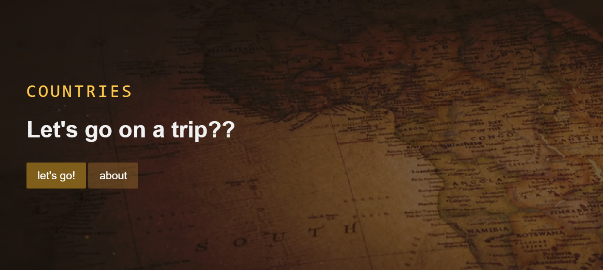
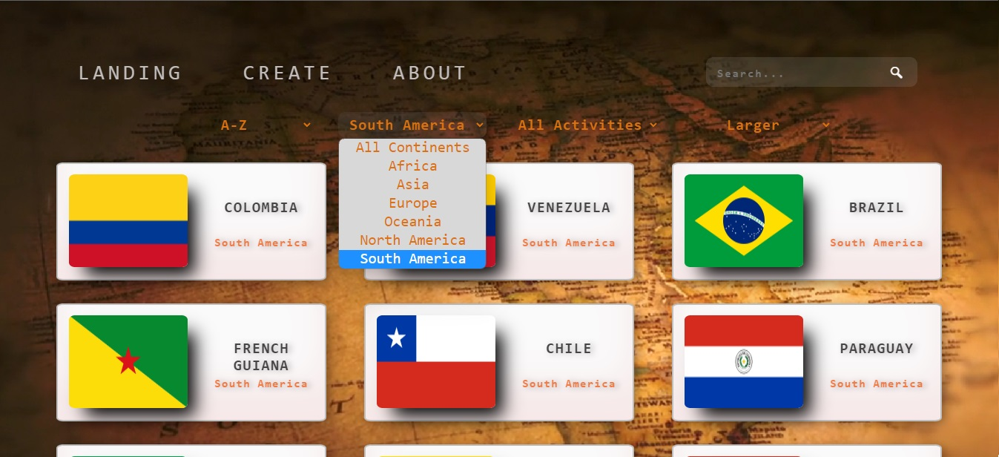
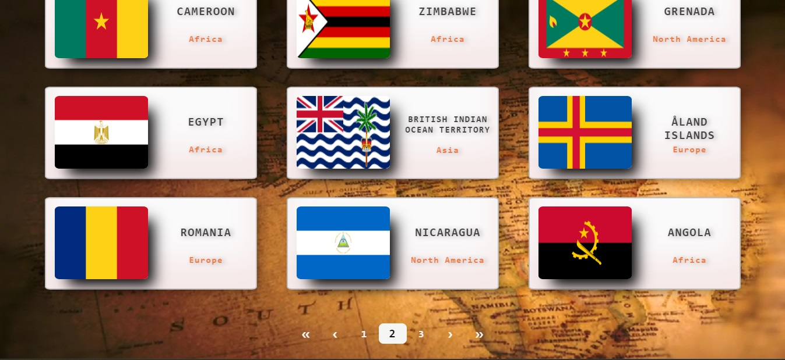
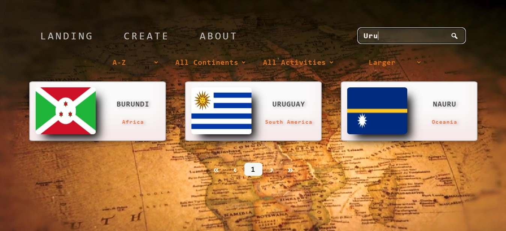
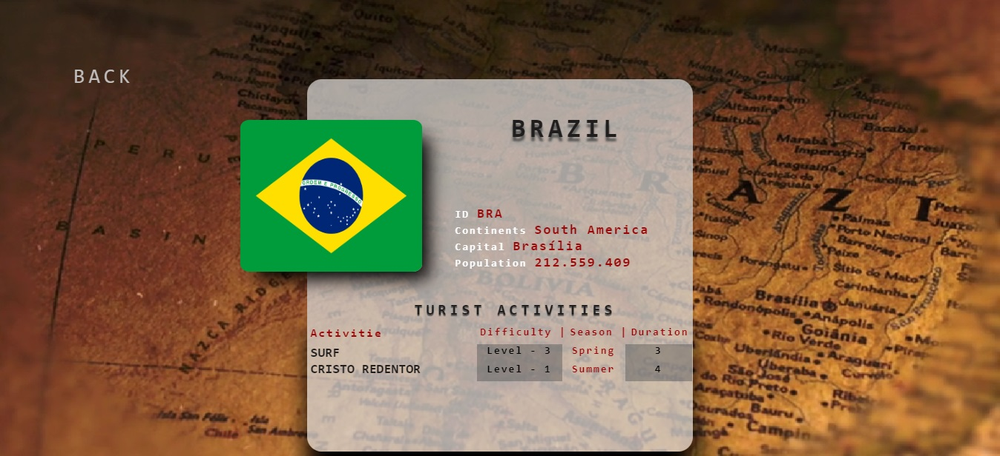
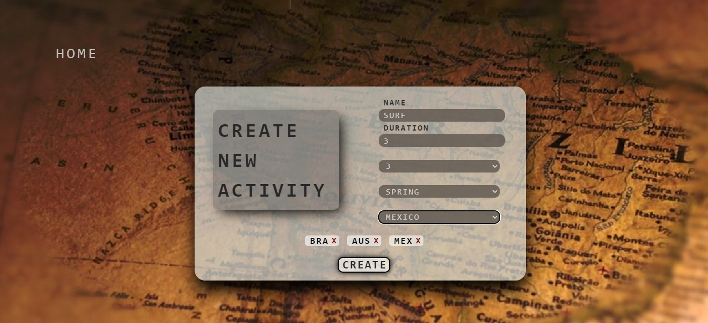

 

  

 

# Individual Project - Henry Countries

  

## Objetivos del Proyecto

- Construir una App utlizando React, Redux, Node y Sequelize.
- Afirmar y conectar los conceptos aprendidos en la carrera.
- Aprender mejores prácticas.
- Aprender y practicar el workflow de GIT.
- Usar y practicar testing.

## Resultado

La idea general fue crear una aplicación en la cual se pueda ver información de distintos paises utilizando la api externa [restcountries](https://restcountries.com/) y a partir de ella poder, entre otras cosas:

- Buscar paises
- Filtrarlos / Ordenarlos
- Crear actividades turísticas

#### Tecnologías utilizadas

- [ ] React
- [ ] Redux
- [ ] Express
- [ ] Sequelize - PostgreSQL

## Frontend

Aplicación de React/Redux que contiene las siguientes pantallas/rutas.

**Pagina inicial**: landing page con

- [ ] Imagen de fondo representativa al proyecto
- [ ] Botón para ingresar al home (`Ruta principal`)

<h3>Landing Page<h3>
  

**Ruta principal**: contiene

- [ ] Input de búsqueda para encontrar países por nombre o ID
- [ ] Área donde se ve el listado de países. Al iniciar carga los primeros resultados obtenidos desde la ruta `GET /countries` y muestra su:
  - Imagen de la bandera
  - Nombre
  - Continente
- [ ] Botones/Opciones para filtrar por continente y por tipo de actividad turística
- [ ] Botones/Opciones para ordenar tanto ascendentemente como descendentemente los países por orden alfabético y por cantidad de población
- [ ] Paginado para ir buscando y mostrando los siguientes paises.

<h3>Home page y filtros<h3>
  

<h3>Paginado<h3>
  

<h3>Search Bar<h3>
  

**Ruta de detalle de país**: contiene

- [ ] Los campos mostrados en la ruta principal para cada país (imagen de la bandera, nombre, ID y continente)
- [ ] Código de país de 3 letras (id)
- [ ] Capital
- [ ] Subregión
- [ ] Población
- [ ] Actividades turísticas con toda su información asociada

<h3>Detail Country con actividades turistica correspondiente<h3>
  

**Ruta de creación de actividad turística**: contiene

- [ ] Un formulario **controlado con JavaScript** con los siguientes campos:
  - Nombre
  - Dificultad
  - Duración
  - Temporada
- [ ] Posibilidad de seleccionar/agregar varios países en simultáneo
- [ ] Botón/Opción para crear una nueva actividad turística

El formulario de creación está validado con JavaScript.

<h3>Create page<h3>
  

<h3>About me<h3>
  

## Base de datos

El modelo de la base de datos tiene las siguientes entidades:

- [ ] País con las siguientes propiedades:
  - ID
  - Nombre
  - Imagen de la bandera
  - Continente
  - Capital
  - Subregión
  - Población
- [ ] Actividad Turística con las siguientes propiedades:
  - ID
  - Nombre
  - Dificultad (Entre 1 y 5)
  - Duración
  - Temporada (Verano, Otoño, Invierno o Primavera)

La relación entre ambas entidades es de muchos a muchos ya que un país puede contener varias actividades turísticas y, a su vez, una actividad turística puede darse en múltiples países.

## Backend

Se desarrolló un servidor en Node/Express con las siguientes rutas:

- [ ] **GET /countries**:
  - En una primera instancia trae todos los países desde restcountries y los guarda en la base de datos, luego se utilizan desde allí (Retonar sólo los datos necesarios para la ruta principal)
  - Obtiene un listado de todos los paises.
- [ ] **GET /countries/{idPais}**:
  - Obtiene el detalle de un país en particular
  - Trae solo los datos pedidos en la ruta de detalle de país
  - Incluye los datos de las actividades turísticas correspondientes
- [ ] **GET /countries?name="..."**:
  - Obtiene los países que coincidan con el nombre pasado como query parameter (No necesariamente tiene que ser una matcheo exacto)
  - Si no existe ningún país mostrar un mensaje adecuado
- [ ] **POST /activities**:
  - Recibe los datos recolectados desde el formulario controlado de la ruta de creación de actividad turística por body
  - Crea una actividad turística en la base de datos, relacionada con los países correspondientes

## Testing

- [ ] Tiene un componente del frontend con sus tests respectivos
- [ ] Tiene una ruta del backend con sus tests respectivos
- [ ] Tiene un modelo de la base de datos con sus tests respectivos
